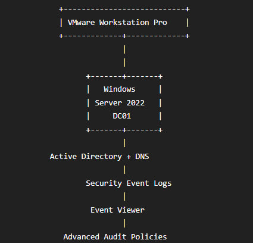
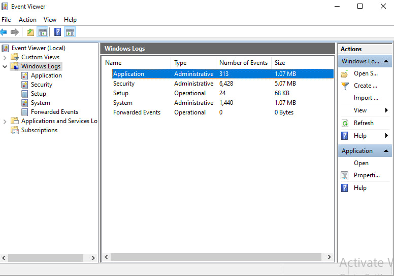
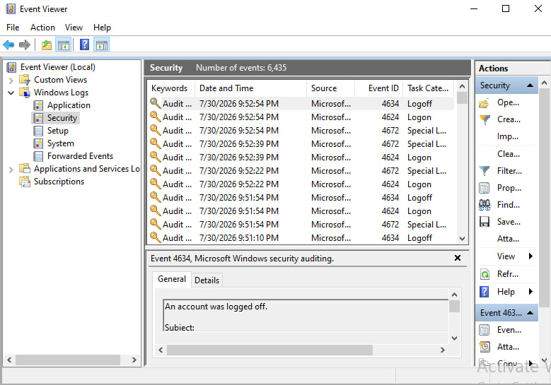
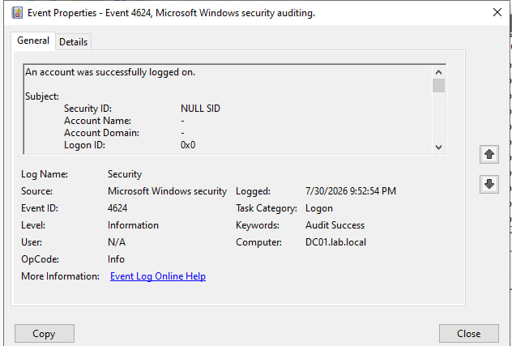
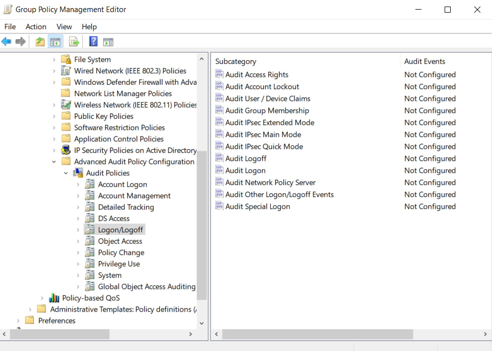
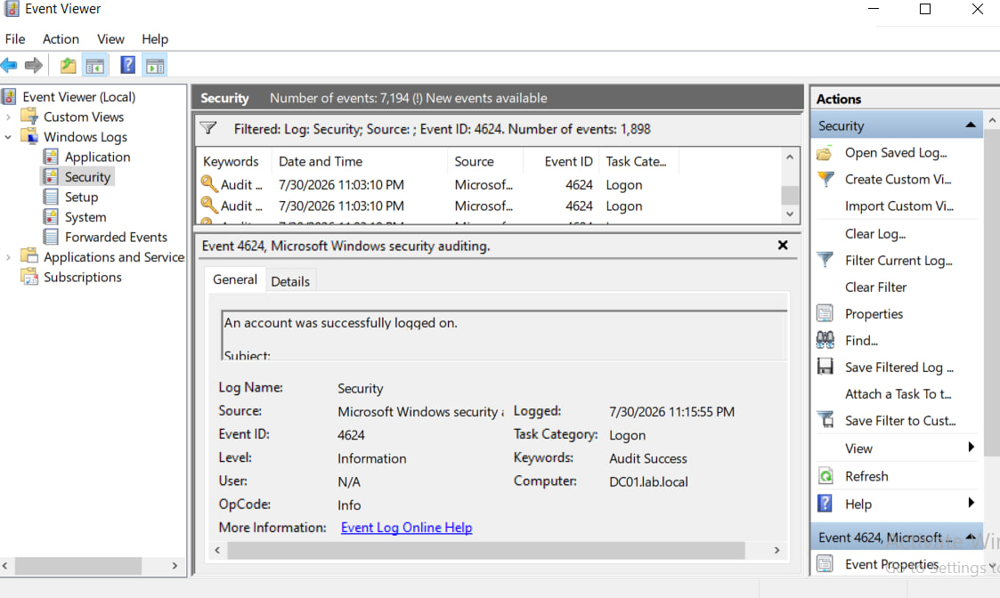

 # Windows Security Event Logs Enterprise Lab

<p align="center">


</p>

---

## Business Scenario

A Security Operations Center (SOC) requires complete visibility into authentication activities, account management events, privilege assignments, and system actions across Windows servers.

This lab demonstrates how Windows Security Event Logs are generated, audited, and analyzed to support security monitoring, threat hunting, and incident response.

The environment was built on the Active Directory infrastructure created in the previous project and prepares the system for Sysmon, SIEM, and Threat Detection labs.

---

# Project Overview

This repository documents the configuration and analysis of Windows Security Event Logs within an enterprise Active Directory environment.

Rather than simply viewing logs, the goal of this lab is to understand how Windows records security events, how administrators enable auditing, and how SOC analysts investigate authentication and security-related activities.

---

# Objectives

- Explore Windows Event Viewer
- Understand Windows Logging Architecture
- Investigate Windows Security Logs
- Configure Advanced Audit Policy
- Generate Authentication Events
- Analyze Security Event IDs
- Understand Windows Audit Categories
- Prepare Windows for SIEM Integration

---

# Lab Environment

| Component | Configuration |
|------------|---------------|
| Hypervisor | VMware Workstation Pro |
| Operating System | Windows Server 2022 |
| Hostname | DC01 |
| Domain | lab.local |
| Active Directory | Enabled |
| Event Viewer | Configured |
| Audit Policy | Advanced Audit Policy |

---

# Lab Architecture

> Windows Security Monitoring Flow



---

# Windows Logging Architecture
```text
User Activity
      │
      ▼
Authentication
      │
      ▼
Windows Security Audit
      │
      ▼
Security Event Log
      │
      ▼
Event Viewer
      │
      ▼
SOC Analyst
      │
      ▼
Incident Investigation
```
---

# Windows Event Log Categories

The following Windows log channels were explored during this project.

| Log Name | Purpose |
|----------|----------|
| Security | Authentication & Auditing |
| System | Operating System Events |
| Application | Application Events |
| Setup | Installation Events |
| Forwarded Events | Remote Log Collection |

---

# Security Event IDs Investigated

| Event ID | Description |
|----------|-------------|
| 4624 | Successful Logon |
| 4625 | Failed Logon |
| 4634 | Logoff |
| 4648 | Logon with Explicit Credentials |
| 4672 | Special Privileges Assigned |
| 4688 | Process Creation |
| 4720 | User Account Created |
| 4726 | User Account Deleted |
| 4728 | User Added to Security Group |
| 4732 | User Added to Local Group |

---

# Audit Policy Configuration

The following Advanced Audit Policy categories were reviewed and configured.

- Account Logon
- Account Management
- Logon / Logoff
- Object Access
- Policy Change
- Privilege Use
- Process Tracking
- Directory Service Access
- System Events

---

# Project Scope

The following components were implemented during this lab.

- Windows Event Viewer
- Security Log Analysis
- Authentication Monitoring
- Windows Audit Policies
- Advanced Audit Policy Configuration
- Event ID Investigation
- Security Log Filtering
- Event XML Inspection

---

# Security Relevance

Windows Security Logs are one of the primary telemetry sources used by Security Operations Centers.

Every authentication, privilege assignment, user creation, group modification, and process execution leaves evidence within Windows Event Logs.

Understanding these logs is essential before deploying SIEM solutions such as Splunk or Wazuh.
This repository establishes the logging foundation required for advanced detection engineering and threat hunting.

---

# Technical Skills Demonstrated

- Windows Security Monitoring
- Event Viewer Investigation
- Security Log Analysis
- Event ID Analysis
- Authentication Monitoring
- Windows Auditing
- Advanced Audit Policy
- Group Policy Management
- Windows Security Fundamentals

---

# Project Gallery

## Event Viewer



---

## Security Log



---

## Successful Logon (4624)



---

## Failed Logon (4625)


---

## Logoff Event (4634)


---

## Advanced Audit Policy



---

## Group Policy Management



---

# Enterprise Design Highlights

- Windows Native Security Monitoring
- Enterprise Audit Policy Configuration
- Authentication Visibility
- Event ID Investigation
- Windows Logging Architecture
- Security Event Collection
- SIEM-ready Infrastructure

---

# Lessons Learned

During this project I gained practical experience with:

- Windows Security Logging
- Event Viewer Investigation
- Authentication Analysis
- Windows Audit Policies
- Security Event IDs
- Audit Configuration
- Windows Security Monitoring
- Security Log Investigation

---

# Future Work

The environment created in this repository will be extended with:

- Sysmon Deployment
- Sysmon Event Analysis
- Wazuh SIEM
- Sigma Rules
- Threat Detection
- MITRE ATT&CK Mapping
- Incident Response
- Log Correlation
- Threat Hunting

---

# Repository Status

| Module | Status |
|----------|--------|
| Windows Event Viewer | ✅ |
| Security Event Logs | ✅ |
| Audit Policies | ✅ |
| Authentication Events | ✅ |
| Event ID Investigation | ✅ |
| Security Log Analysis | ✅ |
| Sysmon | ⏳ |
| Wazuh SIEM | ⏳ |
| Sigma Rules | ⏳ |
| Threat Detection | ⏳ |

---

# Author

Mohammad Khazaee

Cybersecurity Portfolio

Windows Security • Active Directory • SOC • SIEM • Threat Detection